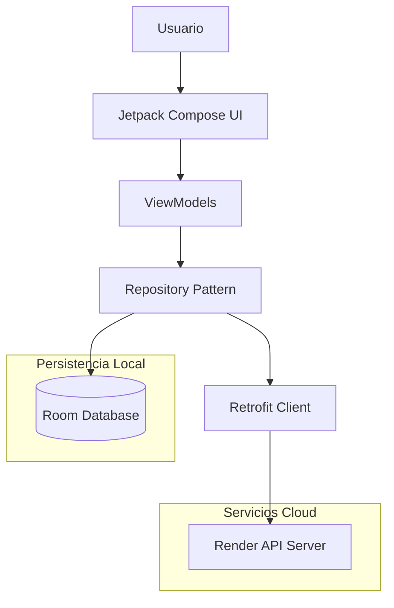

<div align="center">
  
  <h1>MindTrack</h1>
  <p><b>Simulador Inteligente de Toma de Decisiones</b></p>

[](https://kotlinlang.org)
[](https://android.com)
[](https://m3.material.io)
[](https://github.com/Diedereich/MindTrackApp)

  <p><i>Comprende y mejora tu perfil conductual a través de simulaciones interactivas de la vida real.</i></p>
</div>

---

# 📋 Tabla de Contenidos
- [Descripción](#-descripción)
- [Objetivos](#-objetivo)
- [Características](#-características)
- [Arquitectura](#-arquitectura)
- [Tecnologías](#-tecnologías)
- [Instalación](#-instalación)
- [Estructura del Proyecto](#-estructura)
- [API Endpoints](#-api)
- [Autores](#-autores-y-soporte)

---

# 📖 Descripción

**MindTrack** es una herramienta de autoconocimiento diseñada para que los usuarios enfrenten dilemas cotidianos en áreas como el trabajo, salud, social e inversión. A través de un motor de simulación adaptativo, la app analiza patrones de comportamiento y clasifica al usuario en perfiles específicos:

| 🧠 Racional | ♟️ Estratégico | ⚡ Impulsivo |
| :--- | :--- | :--- |
| Prioriza la lógica y el análisis de consecuencias. | Equilibra intuición y progreso a largo plazo. | Actúa rápido bajo presión y factores emocionales. |

## 🎯 Objetivo

Centralizar el análisis conductual en una experiencia gamificada, proporcionando métricas precisas sobre la toma de decisiones con persistencia híbrida.

## ✨ Características

- **Simulación Dinámica**: Gestión de estados vitales (Energía, Estrés, Progreso, Dinero) que reaccionan a cada elección.
- **Arquitectura Híbrida**: Almacenamiento local con **Room** (Offline-first) y sincronización en la nube con **Retrofit**.
- **Dashboard de Analytics**: Visualización de tendencias con Sparklines, gráficos de distribución y seguimiento de racha.
- **Sistema de Gamificación**: Más de 12 logros desbloqueables con emojis dinámicos y progresión por niveles.
- **Globalización**: Soporte nativo y dinámico para **Español** e **Inglés** en el 100% de la interfaz.
- **Notificaciones Inteligentes**: Control manual de alertas y validación de permisos de sistema.

---

# 🏗 Arquitectura



---

# 💻 Tecnologías

<details>
<summary><b>Ver stack tecnológico completo</b></summary>

- **Lenguaje**: Kotlin 2.2.10
- **UI Framework**: Jetpack Compose (Material 3)
- **Persistencia Local**: Room Database
- **Networking**: Retrofit 2.11.0 + OkHttp + Logging Interceptor
- **Inyección de Dependencias**: ViewModelProvider Factory
- **Gestión de Estado**: Kotlin Coroutines & Flow (StateFlow)
- **Imágenes**: Coil Compose
- **Persistencia Simple**: DataStore Preferences
- **Procesamiento**: KSP (Kotlin Symbol Processing)
</details>

---

# 🚀 Instalación y Ejecución

### Requisitos
- **Android Studio Ladybug** o superior.
- SDK de Android **API 35** instalado.
- Dispositivo con **Android 8.0 (API 26)** o superior.

### Pasos
```bash
# 1. Clonar el repositorio
git clone https://github.com/Diedereich/MindTrackApp.git

# 2. Entrar al directorio
cd MindTrackApp

# 3. Sincronizar Gradle en Android Studio y presionar Run 'app'
```

---

# 📁 Estructura

```text
MindTrackApp/
 ├── app/
 │    ├── src/main/java/ni/edu/uam/mindtrack/
 │    │    ├── data/        # Dao Local, API Remota, Repositorios
 │    │    ├── model/       # Entidades, DTOs, Modelos de Dominio
 │    │    ├── ui/          # Screens, Componentes, Temas
 │    │    └── viewmodel/   # Lógica de estado y negocio
 │    └── res/              # Strings multi-idioma (es/en), Assets
 └── README.md
```

---

# 🌐 API

| Método | Endpoint | Descripción |
|---------|----------|-------------|
| GET | `/api/usuarios/{id}` | Obtener perfil de usuario |
| POST | `/api/usuarios` | Registrar nuevo usuario |
| PUT | `/api/usuarios/{id}` | Actualizar datos de perfil |
| DELETE | `/api/usuarios/{id}` | Eliminar cuenta por ID |
| GET | `/api/sessions` | Consultar historial global |
| POST | `/api/sessions` | Registrar resultado de simulación |
| GET | `/api/logros/usuario/{id}` | Consultar logros desbloqueados |

---

# 👨‍💻 Autores y Soporte

<table align="center">
  <tr>
    <td align="center">
      <br />
      <b>Diedereich Aleman</b><br />
      <a href="mailto:diedereicha@uamv.edu.ni">diedereicha@uamv.edu.ni</a>
    </td>
    <td align="center">
      <br />
      <b>Elias Marin</b><br />
      <a href="mailto:eamarin@uamv.edu.ni">eamarin@uamv.edu.ni</a>
    </td>
    <td align="center">
      <br />
      <b>Oscar Alvarado</b><br />
      <a href="mailto:eamarin@uamv.edu.ni">oalvarado@uamv.edu.ni</a>
    </td>
  </tr>
</table>

<div align="center">
  <p><i>Desarrollado como proyecto final de la asignatura de Programación Orientada a Objetos II © 2026</i></p>
</div>
